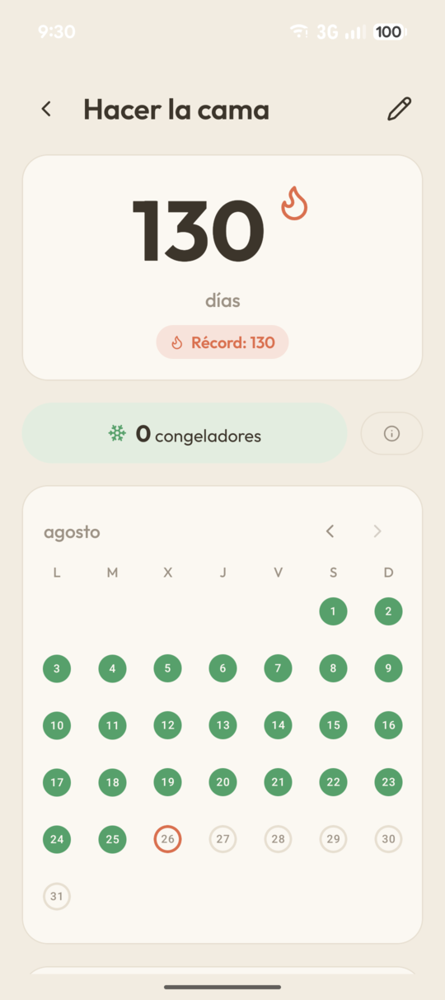
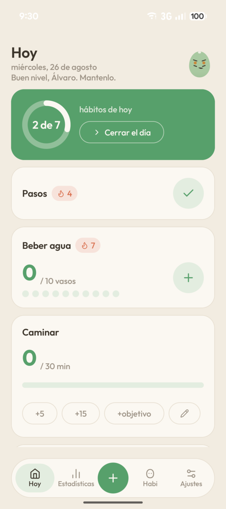
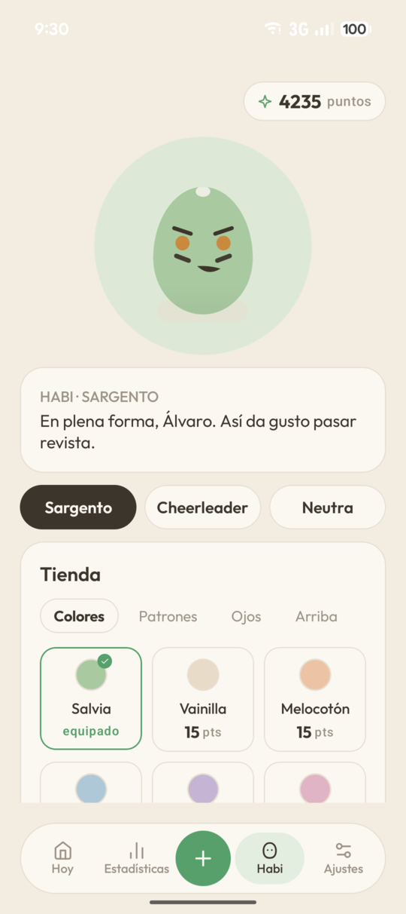
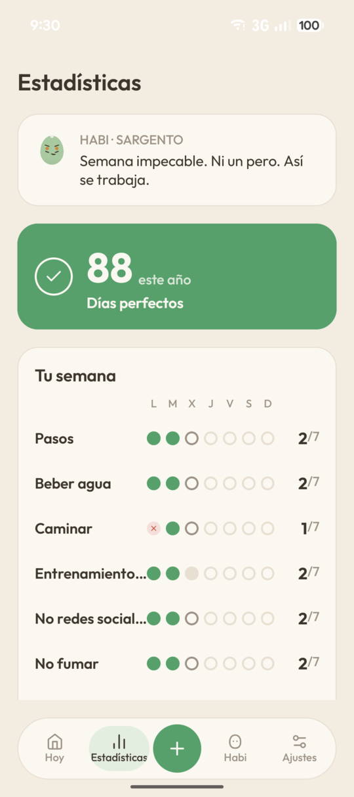
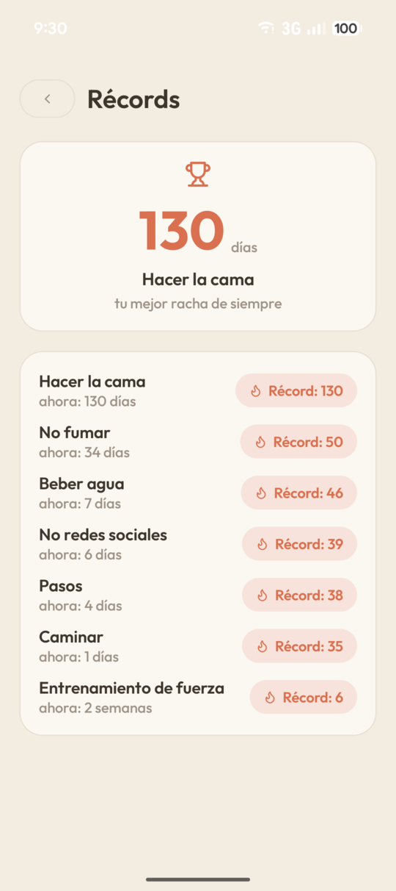
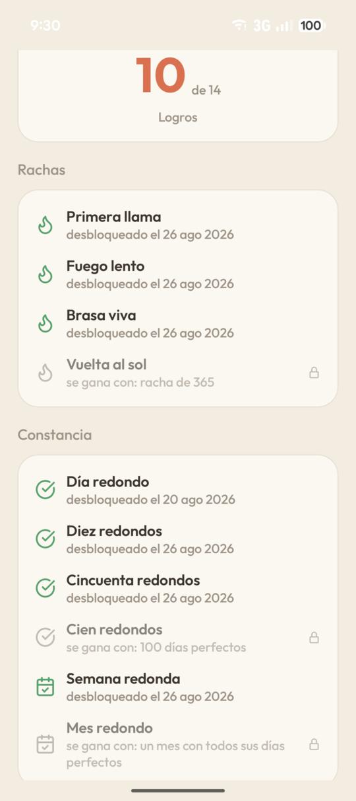
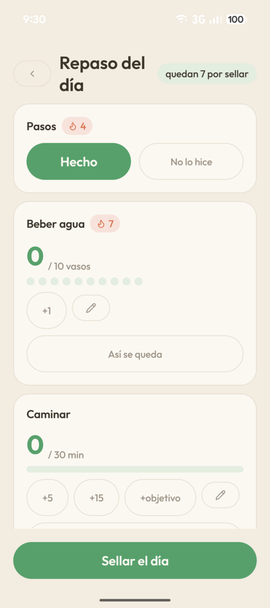
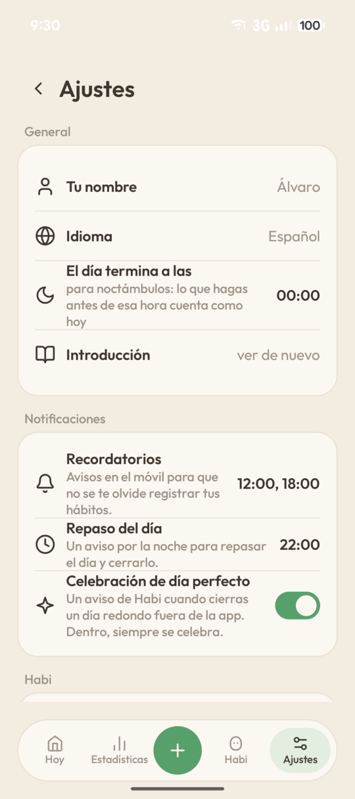

Disponible también en [English](./README.md).


# Bito

**Un toque. Ya está.**

La app de hábitos que no te roba tiempo. Vive entera en tu móvil: sin cuentas, sin nube y sin una sola línea que salga a internet.

[](https://github.com/alvarotorresc/bito/actions/workflows/ci.yml)
[](https://github.com/alvarotorresc/bito/releases/latest)
[](./LICENSE)
[](https://github.com/alvarotorresc/bito/releases/latest)

Versión 1.0.0 · Android 8.0 o superior · 100% libre, GPL-3.0-or-later

## Descargar

[**Descargar Bito 1.0.0**](https://github.com/alvarotorresc/bito/releases/download/v1.0.0/app-release.apk) — 4,7 MB, directo desde GitHub Releases.

Android va a avisar de que la app viene de un origen desconocido: es lo esperable fuera de Google Play, no una señal de alarma propia de Bito. Abre el fichero descargado y, si te lo pide, permite instalar desde el navegador o el gestor de archivos solo esta vez, y pulsa **Instalar**. Sin cuenta, sin asistente de configuración, sin nada que iniciar sesión.

## Qué es

Bito es una app Android de seguimiento de hábitos construida sobre una idea: apuntar que lo has hecho no debería ser otra tarea.

**Tres maneras de registrar. Dos de ellas ni siquiera te piden abrir la app.**

- **Desde la pantalla de inicio** — el widget enseña lo de hoy y se registra con un toque, sin entrar en ninguna parte. Y si solo te importa un hábito, hay un widget pequeño para él solo.
- **Desde la notificación** — el recordatorio llega con el botón puesto. Lo pulsas y queda apuntado sin desbloquear nada más.
- **En el repaso de la noche** — una pantalla al final del día para cerrar lo que quedó suelto. Sellas el día y se acabó.

Y una vez dentro:

- **Rachas que no te castigan** — fallar un día no borra un mes. Hay congeladores para los días imposibles y puedes apuntar hacia atrás cuando te acuerdes tarde.
- **Cantidades, duraciones y cosas que dejar** — ocho vasos de agua, veinte minutos de lectura o un día más sin fumar. Cada tipo se registra como pide su forma.
- **Recordatorios con la voz que elijas** — el aviso cambia de tono según la hora del día y según a quién le hayas dado la voz. Por la mañana plantea el día; por la noche te ayuda a cerrarlo.
- **Logros y estadísticas de verdad** — mapas de calor, récords y logros que se ganan solos. Los números están para que veas cómo vas, no para presumir en ningún sitio.

## Las copias de seguridad: la joya de la corona

### Sin nube, la pregunta llega sola: ¿y si pierdo el móvil?

Por eso las copias de seguridad no son un ajuste escondido en Bito: son parte del motor. Cada copia lleva **todo** —hábitos, registros, rachas, puntos, logros y lo que Habi lleva puesto— y va a la carpeta que tú elijas. La tarjeta de memoria, un pendrive, una carpeta que otra app sincronice por ti. Donde tú digas.

- **En claro, es legible** — un JSON que abres con el bloc de notas y entiendes. Tus datos no se te devuelven en un formato que solo Bito sepa leer.
- **Cifrado, no lo abre nadie** — le pones una contraseña y el fichero se vuelve ilegible incluso para Bito. Sin esa contraseña no hay vuelta atrás, y eso es justo lo que quieres.
- **Solas, mientras duermes** — las copias automáticas se hacen y van rotando las últimas, sin que tengas que acordarte de nada.
- **Restaurar sin sustos** — antes de tocar nada te enseña qué va a entrar y qué va a cambiar. Decides tú, con la información delante.

## Capturas

El detalle de un hábito, racha de 130 días con el calendario lleno:



| Hoy | Habi y la tienda | Estadísticas |
|---|---|---|
|  |  |  |

<details>
<summary>Más capturas</summary>
<br>

| Récords | Logros | Repaso del día | Ajustes |
|---|---|---|---|
|  |  |  |  |

</details>

## Habi y sus tres personalidades

Habi no es un adorno. Su cara refleja cómo llevas la semana, se hunde como gelatina justo donde lo tocas y te sigue con la mirada. Lo vistes con los puntos que te gana tu constancia, y te habla con la voz que tú elijas.

| Sargento | Cheerleader | Neutra |
|---|---|---|
|  |  |  |
| «Aceptable. Tú y yo sabemos que puedes más.» | «Buena semana. ¡Y la que viene, mejor!» | «Semana dentro de lo normal. Sigue así.» |
| Exige porque cree en ti. Frases cortas, cero relleno, y el elogio llega seco y como quien ya contaba con ello. | Celebra en grande lo que es grande y se queda cerca en los días malos. Nunca te endulza una recaída. | Constata con precisión y deja siempre una puerta pequeña abierta. Cálida en voz baja, sin una sola exclamación. |

Se elige al empezar y se cambia cuando quieras. La cara también cambia: mírale los ojos, las cejas y la boca.

## Lo que Bito no va a hacer nunca

Una lista de features se puede cambiar cuando conviene. Esto no: es la forma de la app, y es lo que la licencia protege.

- **Nunca** te pedirá una cuenta ni un correo
- **Nunca** subirá tus datos a una nube
- **Nunca** tendrá anuncios
- **Nunca** medirá lo que haces dentro
- **Nunca** dependerá de los servicios de Google
- **Nunca** cobrará por una función que ya tenías
- **Nunca** crecerá por votación: Bito se diseña para resolver un problema concreto, no para acumular funciones que alguien pidió. Se escucha el fallo, no la lista de deseos.

<details>
<summary><strong>Detalles técnicos</strong></summary>

### Por dentro

Bito no te pide que te fíes de su palabra. El código está entero ahí fuera y la promesa de privacidad se comprueba en una línea.

| | |
|---|---|
| **962** | tests que pasan en cada cambio |
| **0** | dependencias de Google Play Services |
| **4** | permisos, y ninguno es internet |
| **100%** | del código bajo GPL-3.0-or-later |

### Compruébalo tú

La app no puede mandar tus datos a ninguna parte porque no declara el permiso para hacerlo. Clona el repositorio y ejecuta esto:

```bash
grep -o 'android:name="android.permission[^"]*"' \
  app/src/main/AndroidManifest.xml
```

Salen cuatro líneas:

```
android:name="android.permission.POST_NOTIFICATIONS"
android:name="android.permission.SCHEDULE_EXACT_ALARM"
android:name="android.permission.RECEIVE_BOOT_COMPLETED"
android:name="android.permission.VIBRATE"
```

`INTERNET` no está, y sin él no hay red que valga. Tampoco te fíes de esto por fe: ejecuta el comando tú mismo.

### Cómo está hecha

Funciona igual en GrapheneOS. La lógica de rachas, puntos y ánimo vive aparte de Android y se prueba sola.

| | |
|---|---|
| Lenguaje | Kotlin 2.1.0 |
| Interfaz | Jetpack Compose (BOM 2024.12.01) |
| Widgets | Glance 1.1.1 |
| Datos | Room 2.7.2 · 9 tablas, esquema v1, sin migraciones todavía |
| Mínimo / objetivo | Android 8.0 (API 26) / Android 15 (API 35) |
| Compilación | AGP 8.7.2 · JDK 21 |
| Release | versionName 1.0.0 · versionCode 11 |
| Mascota | Vectorial, dibujada a mano en Canvas |
| Tests | 962 funciones `@Test` en 107 ficheros, en cada push a main y en cada pull request |

### Cómo se cifra una copia

| | | |
|---|---|---|
| De tu contraseña a la clave | Argon2id | 19 MiB de memoria, 2 pasadas. Nivel recomendado por OWASP para móvil. |
| Del contenido al fichero | AES-256-GCM | Etiqueta de 128 bits: si alguien toca un solo byte, la copia se niega a abrirse. |
| A prueba de futuro | Los parámetros viajan dentro | Cada copia lleva escrito cómo se cifró, así que una de hace dos años se sigue restaurando. |

### Compilarla tú mismo

Requisitos: JDK 21 y el Android SDK (API 35).

```bash
./gradlew assembleDebug
```

Si el JDK 21 no es el que tienes por defecto: `JAVA_HOME=/ruta/al/jdk-21 ./gradlew assembleDebug`.

¿Vas a reportar un fallo y necesitas leer una traza de un cierre inesperado? La página del release también trae un `mapping.txt` para desofuscarla — no es parte de la descarga normal.

</details>

## Licencia y marca

[GPL-3.0-or-later](./LICENSE), el 100% del código.

Licencias de terceros:

- Tipografía [Outfit](https://github.com/Outfitio/Outfit-Fonts), bajo [OFL](./THIRD_PARTY_LICENSES/outfit-OFL.txt).
- Iconos [Lucide](https://lucide.dev), bajo [ISC](./THIRD_PARTY_LICENSES/lucide-ISC.txt).

El nombre «Bito» y la identidad de Habi son la marca de este proyecto: los forks son bienvenidos —es la gracia del software libre—, pero deben usar otro nombre y otra mascota para no confundir a los usuarios.

---

Bito · software libre bajo GPL-3.0-or-later · [Código](https://github.com/alvarotorresc/bito) · [Licencia](./LICENSE) · [Contar un fallo](https://tally.so/r/dWe65r)
