Also available in [Español](./README.es.md).


# Bito

**One tap. Done.**

The habit app that won't steal your time. Lives entirely on your phone: no accounts, no cloud, not one line out to the internet.

[](https://github.com/alvarotorresc/bito/actions/workflows/ci.yml)
[](https://github.com/alvarotorresc/bito/releases/latest)
[](./LICENSE)
[](https://github.com/alvarotorresc/bito/releases/latest)

Version 1.3.0 · Android 8.0 or later · 100% free, GPL-3.0-or-later

## Download

[**Download Bito 1.3.0**](https://github.com/alvarotorresc/bito/releases/download/v1.3.0/app-release.apk) — 6.4 MB, straight from GitHub Releases.

Android will warn that this app comes from an unknown source — that's expected outside Google Play, not a red flag specific to Bito. Open the downloaded file, and if you're asked, allow installs from your browser or file manager just this once, then tap **Install**. No account, no setup wizard, nothing to sign in to.

## What it is

Bito is an Android habit tracker built on one idea: logging that you did it shouldn't be its own task.

**Three ways to log it. Two of them don't even ask you to open the app.**

- **From the home screen** — the widget shows today and logs with one tap, no need to go anywhere. Care about just one habit? There's a small widget just for it.
- **From the notification** — the reminder comes with the button built in. Tap it and it's logged, nothing else to unlock.
- **In the evening review** — one screen at day's end to close out what's left. Seal the day and that's it.

And once you're in:

- **Streaks that don't punish** — missing a day doesn't erase a month. Freezers cover the impossible days, and you can backdate an entry when you remember late.
- **Amounts, durations, and things to quit** — eight glasses of water, twenty minutes of reading, or one more day without smoking. Each type logs its own way.
- **Reminders in the voice you pick** — the nudge changes tone by time of day and by which voice you picked. Mornings, it sets up the day; nights, it helps close it.
- **Real badges, real stats** — heatmaps, records, and badges that earn themselves. The numbers are there to show how you're doing, not to show off anywhere.
- **Tasks, and a timer to get going** — the call, the paperwork, the email. Each task gets a deadline, a first step if it helps, and a timer with Habi beside you that keeps running with the screen off.
- **Breathe with Habi** — about two minutes following Habi's breath when the day piles up. Three modes, nothing else to pick. No points, no streaks.

## Backups: the crown jewel

### No cloud: so what if you lose your phone?

That's why backups aren't a setting buried in Bito: they're part of the engine. Every backup carries **everything** —habits, entries, streaks, points, badges, and whatever Habi is wearing— and goes to the folder you pick. An SD card, a USB drive, a folder some other app syncs for you. Wherever you say.

- **Plain and legible** — a JSON file you open in Notepad and understand. Your data doesn't come back in a format only Bito can read.
- **Encrypted, locked tight** — set a password and the file turns unreadable, even to Bito. Without that password there's no way back — and that's exactly the point.
- **While you sleep** — automatic backups happen and rotate the latest ones, with nothing for you to remember.
- **No-surprise restore** — before touching anything, it shows what's coming in and what's changing. You decide, facts in hand.

## Screenshots

A habit's detail, 130 days into a streak, calendar filled in:

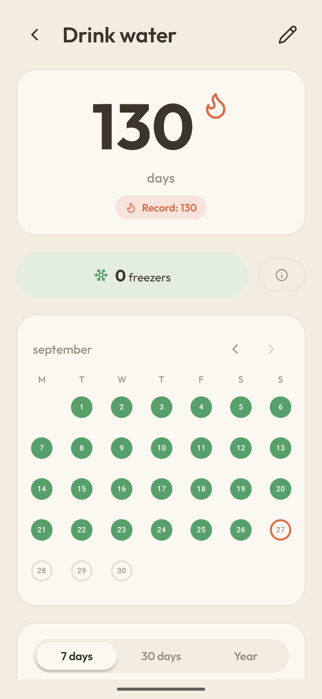

| Today | A task's timer | Breathe |
|---|---|---|
| 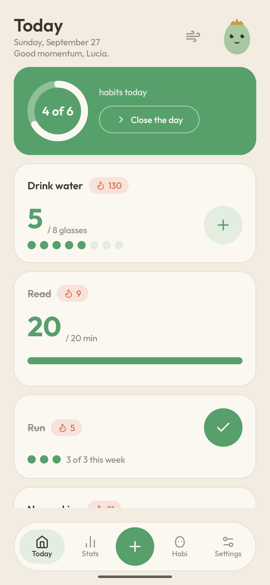 | 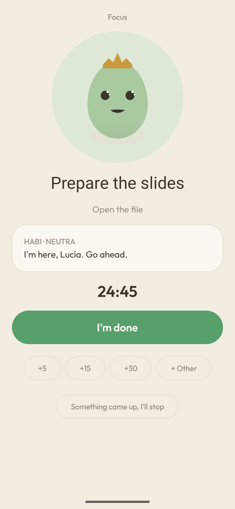 | 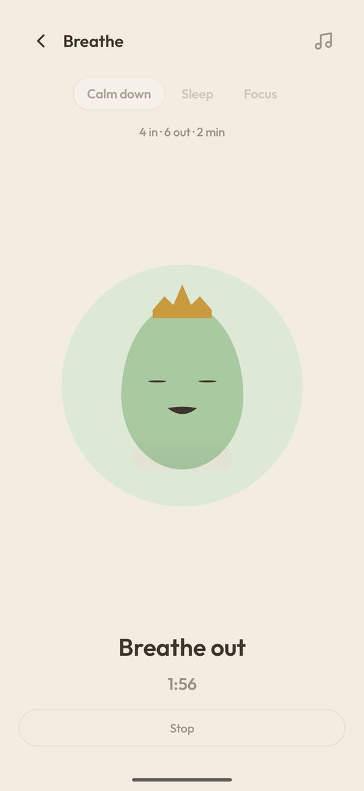 |

<details>
<summary>More screens</summary>
<br>

| Habi and the store | Stats | Records | Badges |
|---|---|---|---|
| 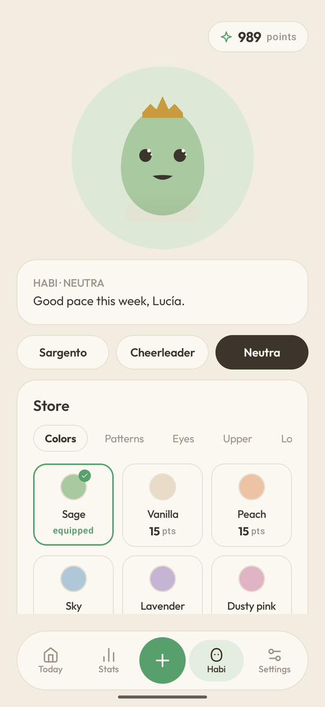 | 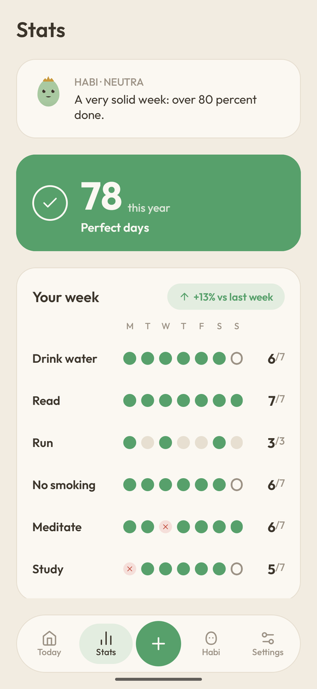 | 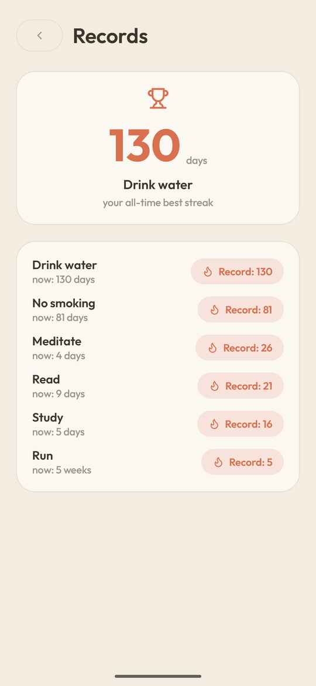 | 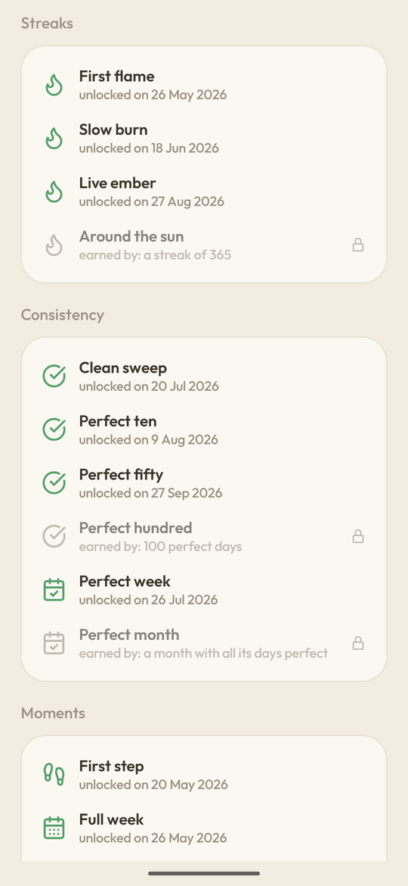 |

| Tasks | Daily review | Settings |
|---|---|---|
| 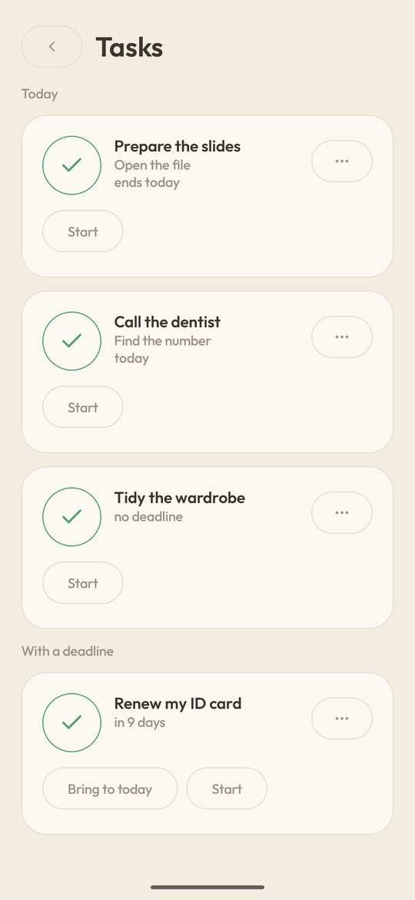 | 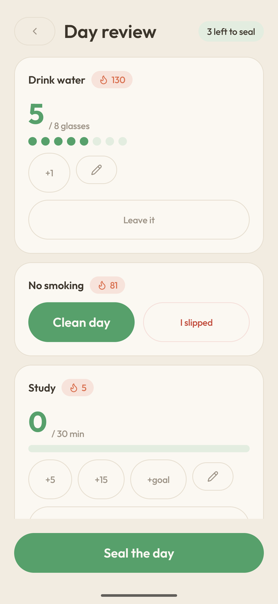 | 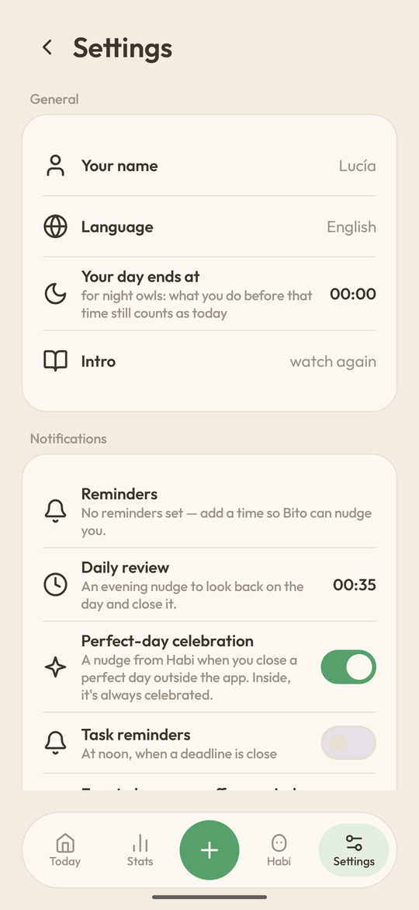 |

</details>

## Habi and its three personalities

Habi's no decoration. Habi's face shows your week, dents like jelly right where you touch it, and follows you with its eyes. You dress Habi in the points your consistency earns, and Habi speaks in the voice you pick.

| Sargento | Cheerleader | Neutra |
|---|---|---|
|  |  |  |
| “Acceptable. We both know you've got more.” | “Good week. And the next one? Even better!” | “A steady week. Keep going.” |
| Demands out of belief in you. Short sentences, zero filler — praise lands dry, like it was already expected. | Celebrates big when it's big, and stays close on bad days. Never sugarcoats a slip. | States with precision, always leaves a small door open. Warm in a low voice, not one exclamation. |

You pick a voice at the start and change it anytime. The face changes too: watch the eyes, eyebrows, and mouth.

## What Bito will never do

A feature list can change whenever it's convenient. This can't: it's the app's shape, and the license protects it.

- **Never** ask for an account or an email
- **Never** upload your data to a cloud
- **Never** have ads
- **Never** track what you do inside
- **Never** depend on Google services
- **Never** charge for a feature you already had
- **Never** grow by popular vote: Bito is designed to solve one concrete problem, not pile up features someone requested. It listens to what's broken, not the wish list.

<details>
<summary><strong>Technical details</strong></summary>

### Inside

Bito doesn't ask you to take its word for it. The code is all out there, and the privacy promise checks out in one line.

| | |
|---|---|
| **1297** | tests passing on every change |
| **0** | Google Play Services dependencies |
| **4** | permissions of its own, no internet |
| **100%** | of the code, GPL-3.0-or-later |

### Verify it

The app can't send your data anywhere, because it doesn't declare the permission to. Clone the repository and run this:

```bash
grep -o 'android:name="android.permission[^"]*"' \
  app/src/main/AndroidManifest.xml
```

It prints four lines:

```
android:name="android.permission.POST_NOTIFICATIONS"
android:name="android.permission.SCHEDULE_EXACT_ALARM"
android:name="android.permission.RECEIVE_BOOT_COMPLETED"
android:name="android.permission.VIBRATE"
```

`INTERNET` isn't there — without it, no network works. Don't take that on faith either; run the command yourself.

Those four are Bito's own. The built APK also carries four more that its libraries add, and none of them is internet either: the [privacy page](https://bito.alvarotc.com/privacy/) lists all eight and how to check them with `aapt2`.

### How it's built

Works the same on GrapheneOS. Streak, point, and mood logic lives apart from Android and tests itself.

| | |
|---|---|
| Language | Kotlin 2.1.0 |
| UI | Jetpack Compose (BOM 2024.12.01) |
| Widgets | Glance 1.1.1 |
| Data | Room 2.7.2 · 12 tables, schema v3 |
| Min / target | Android 8.0 (API 26) / Android 15 (API 35) |
| Build | AGP 8.7.2 · JDK 21 |
| Release | versionName 1.3.0 · versionCode 14 |
| Mascot | Vector, hand-drawn in Canvas |
| Tests | 1297 `@Test` functions across 129 files, run on every push to main and every pull request |

### How backups are encrypted

| | | |
|---|---|---|
| Password to key | Argon2id | 19 MiB of memory, 2 passes. OWASP's recommended level for mobile. |
| From content to file | AES-256-GCM | 128-bit tag: if anyone touches a single byte, the backup refuses to open. |
| Future-proof | The parameters travel inside | Every backup records how it was encrypted, so one from two years ago still restores. |

### Build it yourself

Requirements: JDK 21 and the Android SDK (API 35).

```bash
./gradlew assembleDebug
```

If JDK 21 isn't your default: `JAVA_HOME=/path/to/jdk-21 ./gradlew assembleDebug`.

Filing a bug and need to make sense of a crash trace? The release page also carries a `mapping.txt` to de-obfuscate it — it's not part of the normal download.

</details>

## License and brand

[GPL-3.0-or-later](./LICENSE), 100% of the code.

Third-party licenses:

- [Outfit](https://github.com/Outfitio/Outfit-Fonts) typeface, under [OFL](./THIRD_PARTY_LICENSES/outfit-OFL.txt).
- [Lucide](https://lucide.dev) icons, under [ISC](./THIRD_PARTY_LICENSES/lucide-ISC.txt).
- "Angelic Pad Loop" by [PhonZz](https://freesound.org/people/PhonZz/sounds/242773/) on Freesound, the breathing exercise's background track, under [CC0](https://creativecommons.org/publicdomain/zero/1.0/).

"Bito" and Habi's identity are this project's brand: forks are welcome — that's the whole point of free software — but they need a different name and a different mascot, so nobody confuses them for this one.

---

Bito · free software under GPL-3.0-or-later · [Code](https://github.com/alvarotorresc/bito) · [License](./LICENSE) · [Report a bug](https://tally.so/r/dWe65r) · [Privacy](https://bito.alvarotc.com/privacy/)
